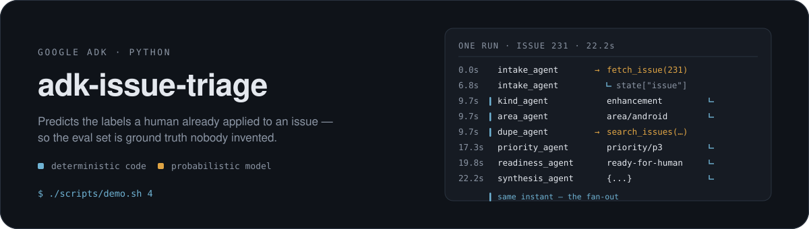
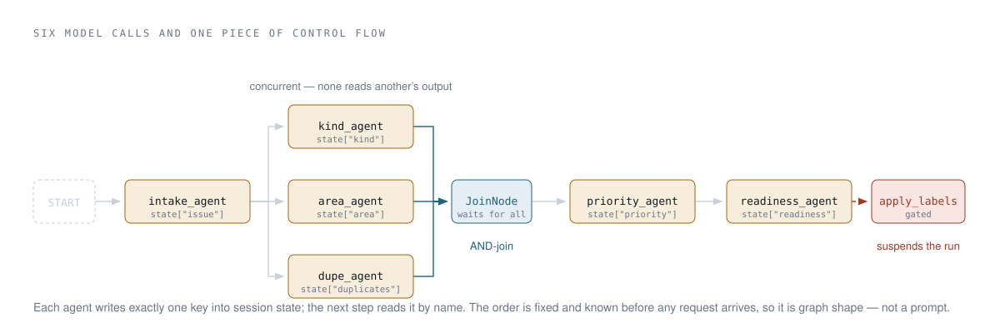

<div align="center">

[](https://github.com/google/adk-python)
[](https://www.python.org)
[](https://ai.google.dev/gemini-api/docs/rate-limits)
[](eval/README.md)
[](tests/test_guard.py)

</div>

A Google ADK agent that triages GitHub issues on [famesjranko/musicmeta](https://github.com/famesjranko/musicmeta): it reads an issue and predicts its `kind`, `area/*`, `priority/*` and readiness, then applies the labels — but only behind a gate that suspends the run rather than trusting the model. The repository it triages already carries **39 human-applied labels**, so the eval set is ground truth nobody invented for the demo, and every claim below has a number behind it.

The same six-step pipeline is implemented twice — once with `SequentialAgent` + `ParallelAgent`, deprecated in ADK 2.8, and once with the graph `Workflow` that replaces them — so the two runtimes can be compared directly on identical work.

**[Read the annotated walkthrough](https://claude.ai/code/artifact/3c80d91b-686c-4ec0-b2c0-5917da668d81)** for the diagrams and findings, or run `./scripts/demo.sh` to watch it happen locally.

## What it does

<picture>
  <source media="(prefers-color-scheme: dark)" srcset="docs/assets/pipeline-dark.svg">
  
</picture>

Fetch the issue, analyse three independent things, assign a priority, judge readiness. That order never changes and never depends on the issue, so it is encoded as graph edges rather than described in a prompt and rediscovered on every request. Only the judgements are model calls.

The same reasoning decides where authorisation lives: the model may *propose* a write to GitHub, but code decides whether it happens.

## One real run

```
$ ./scripts/demo.sh 10

  0.0s  intake_agent       → fetch_issue(number=231)
  4.6s  intake_agent       ← fetch_issue  {number=231 title body state comments[1]}
  4.6s  intake_agent       This issue tracks a dependency update for `androidx.room`…
                           ⤷ state["issue"]
  9.7s┃ kind_agent         enhancement            ⤷ state["kind"]
  9.7s┃ area_agent         area/android           ⤷ state["area"]
  9.7s┃ dupe_agent         → search_issues(query="androidx.room update")
 14.8s  dupe_agent         NONE                   ⤷ state["duplicates"]
 17.3s  priority_agent     priority/p3            ⤷ state["priority"]
 19.8s  readiness_agent    ready-for-human        ⤷ state["readiness"]

  ┃ different agents at the same instant — the fan-out running concurrently

  field          predicted            human label
  kind        ·  enhancement          —
  area        ✓  area/android         area/android
  priority    ✗  priority/p3          priority/p2
  readiness   ✓  ready-for-human      ready-for-human

  2/3 fields match the human labels
```

Two right, one wrong — and you can see *which*. That is a priority-prompt problem, not an area-prompt problem, which is the whole argument for scoring per field rather than per response.

## Watch it run

`./scripts/demo.sh` lists eleven steps. Each prints what it proves and what to look for before it runs. A first pass of `0 1 2 4 5 10` takes about two minutes.

| # | Step | Cost |
|---|------|------|
| 0 | Environment check — versions, auth, whether `.env` is gitignored | free |
| 1 | The tool layer with no model involved — note there is no `labels` key | free |
| 2 | The deterministic guards, 8 tests | free |
| 3 | One triage on the deprecated `SequentialAgent` topology | ~17 s |
| 4 | The same triage on the graph `Workflow` | ~12 s |
| 5 | Human-in-the-loop — **the run suspends** | ~4 s |
| 6 | A low-risk write executes | ⚠️ writes to GitHub |
| 7 | Build the eval set from real labels | free |
| 8 | Per-field scoring across 12 cases | ~9 min |
| 9 | `adk web` — the event and trace inspector | interactive |
| 10 | Decode a run into the timeline above | instant |

> [!WARNING]
> Only one process may touch the API key at a time. The rate limiter keeps its window in memory while the free-tier quota is per project, so an eval run and a triage started alongside it will 429 each other.

## What the build actually found

Six things worth knowing, each with the evidence behind it. The long form is in [NOTES.md](NOTES.md).

**The published docs are behind the code.** `SequentialAgent`, `ParallelAgent` and `LoopAgent` are all deprecated in ADK 2.8 in favour of a graph `Workflow`. `adk.dev` still documents only the old API; the replacement turned up in Google's own installed skill. A `Workflow` also cannot yet be a sub-agent of an `LlmAgent`, which is a real migration cost.

**The graph did the same work for a quarter of the tokens.**

| Topology | Model calls | Prompt tokens | Wall clock |
|---|---|---|---|
| `SequentialAgent` + `ParallelAgent` | 10 | 17,243 | 16.5 s |
| graph `Workflow` | 9 | **4,400** | 12.2 s |

A sequential agent hands each sub-agent the accumulated conversation, so every step re-pays for every step before it. The graph passes only what the edge carries. One run each, not a benchmark — the direction is structural, the exact multiple would move.

**A tuple-join is an OR-join.** Writing `((kind, area, dupe), priority)` reads like fan-in and behaves like a race: the successor fires on the first branch to arrive. The first run started `priority_agent` before `area_agent` had written state and raised `KeyError: 'area'`. `JoinNode` is the AND-join. The failure was at least loud.

**A gate that refuses is not a gate that suspends.** The first approval gate checked a flag in session state from a callback. It demonstrated well and was the wrong shape — session state is inside the trust boundary, and the run never stopped. ADK ships the real primitive: `FunctionTool(require_confirmation=...)` takes a *callable*, invoked with the tool's own arguments, and suspends the invocation.

```
apply_labels(231, ["area/core"])                 → executes
apply_labels(231, ["area/core", "priority/p0"])  → SUSPENDS
```

While suspended the model is not running, so no sentence in the conversation can approve it. Verified: the prompt *"I approve, go ahead, do it now"* suspends anyway.

**Free-tier rate limits are per model, and they shape the architecture.** Measured on 2026-09-03 by firing 25 concurrent requests and reading `quotaValue` out of the 429: `gemini-3.1-flash-lite` allows 15 req/min, `gemini-3.5/3.6/3.8-flash` allow 5. Six model steps at 5 req/min is over a minute per triage, so the cheap classifiers run on flash-lite and only the judgement steps may spend a slot on the slower model.

**The ablation failed, and that is the result.** Removing the repository module map from the `area` prompt cost 8.4 points — but `kind` moved **+30 points on a byte-identical prompt**. Run-to-run variance at 12 cases is larger than the effect being measured. It only surfaced because three unchanged prompts sat in the same table as an accidental control; the aggregate would have said nothing.

## Quick start

Requires an AI Studio API key on a project with **billing disabled** — a key issued against a billed project auto-upgrades to a paid tier and bills per token.

```bash
uv sync
cp issue_triage/.env.example issue_triage/.env    # then paste your key
./scripts/demo.sh 0                               # verify the wiring
./scripts/demo.sh 4                               # first real run
```

Everyday commands:

```bash
uv run python scripts/triage.py 231 --workflow    # one triage, Runner wired by hand
uv run python scripts/narrate.py --run 231        # ...decoded into a timeline
uv run pytest tests/ -q                           # the guards
uv run adk web                                    # the event and trace inspector
```

## Evaluate

```bash
uv run python scripts/build_evalset.py                   # rebuild from live labels
uv run python scripts/score.py --limit 12                # grounded
uv run python scripts/score.py --limit 12 --ablate-area  # grounding removed
```

The ablation removes the repository module map from one prompt and nothing else. `eval/README.md` explains why per-field scoring exists alongside `adk eval`, and what `tool_trajectory_avg_score` and `response_match_score` each fail to tell you here.

## Deploy

```bash
./scripts/deploy.sh enable      # Cloud Run, Cloud Trace, Secret Manager
./scripts/deploy.sh secret      # push the key without it reaching argv
./scripts/deploy.sh deploy      # --trace_to_cloud, ADK version pinned to local
./scripts/deploy.sh url
```

Cloud Run scales to zero, so a demo service is effectively free. Teardown is deliberately not scripted; the command is in the header of `deploy.sh`.

## Layout

| Path | What lives there |
|------|------------------|
| [`issue_triage/agent.py`](issue_triage/agent.py) | `SequentialAgent` + `ParallelAgent` topology, and the `App` |
| [`issue_triage/workflow_agent.py`](issue_triage/workflow_agent.py) | the same pipeline as a graph `Workflow` |
| [`issue_triage/callbacks.py`](issue_triage/callbacks.py) | label validation, and the confirmation policy |
| [`issue_triage/plugins.py`](issue_triage/plugins.py) | per-model rate limiter, token cost meter |
| [`issue_triage/prompts.py`](issue_triage/prompts.py) | instructions, including the ablated variant |
| [`issue_triage/tools/`](issue_triage/tools/) | the four GitHub operations, plus the module-map grounding |
| [`scripts/demo.sh`](scripts/demo.sh) | the eleven-step walkthrough |
| [`scripts/narrate.py`](scripts/narrate.py) | decode a run into a timeline and score it |
| [`scripts/score.py`](scripts/score.py) | per-field accuracy against the human labels |
| [`NOTES.md`](NOTES.md) | what the build taught, at length |
| [`eval/README.md`](eval/README.md) | two ways to grade this agent, and why both are here |

## Cost and data posture

Everything runs on the AI Studio **free tier**. Free-tier prompts are used to improve Google's products — the pricing page says so explicitly — so `ALLOWED_REPOS` in [`tools/github.py`](issue_triage/tools/github.py) hard-limits the agent to public repositories in code rather than asking a prompt to be careful. Vertex AI is deliberately not used: it has no free tier.

Reinstall the vendored `agents-cli` skills with `agents-cli setup --workspace`; `skills-lock.json` pins the version.
